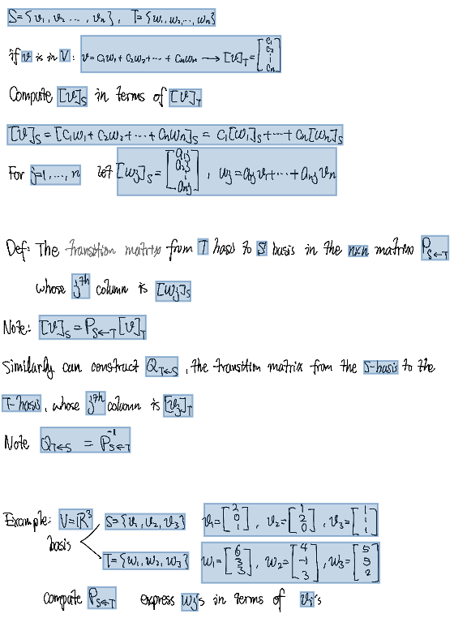
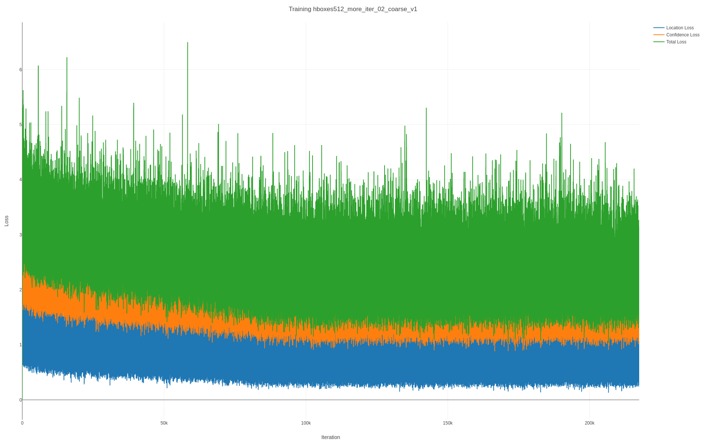

---
bibliography:
- bibliography.bib
date: November 2020
title: Progress Report
---

**A Single Shot MultiBox Detector Based Handwritten Formula Detector**

Group 48 Final Project Report

Reid Chen\
Department of Computer Sciences, Junior

Jijie Zhang\
Department of Economics, Junior

University of Wisconsin-Madison\

Introduction and Background
===========================

As a college student, great note-taking skill is the path to success.
Nowadays, many students decide to use the iPad or Microsoft Surface to
take handwritten notes electronically due to their convenience. One of
the benefits of taking notes in this manner is that electronic
note-taking applications can recognize handwritten texts so that
students can search through their notes and find what they need
instantly. Although notes can be converted to searchable texts
successfully. Note-taking apps usually fail to recognize mathematical
formulas or expressions that are pervasive in the notes of a science or
engineering student's note. Nevertheless, this might be something
note-taking app's users are requiring. So, we initially wanted to find a
way so that mathematical formulas among notes, usually in PDF format,
can be recognized.

Although note-taking apps do not have the feature of recognizing math
symbols globally, i.e., these apps cannot detect where the formulas are,
some of them have the ability to recognize math formulas given that the
user tells the application where the math formulas are. For example,
Notability [@notability_2020] recently announced a math conversion
feature that converts a selected region of handwritten math into
typewritten math. This shows that a mathematical recognizer exists. In
fact, handwritten mathematical formula recognizers like
[@zhang2018multi] outperforms the state-of-the-art accuracy in the
Competition on Recognition of Online Handwritten Mathematical
Expressions (CROHME). We also found a commercial mathematical recognizer
called Mathpix [@mathpix_snip], which provides mathematical recognizer
API. These existing recognizers only work well on an image containing a
single formula. They cannot be used directly because the input should be
a PDF file or images of each page from notes. Therefore, retrieving the
mathematical expressions or finding where the mathematical symbols are
from inputs is essential.

Researches in object detection provide methods of solving the detection
problem. Fast R-CNN [@girshick2015fast] and Faster R-CNN
[@ren2015faster] can both enable formula detection, but these methods
require a long computational power and time. Since we wish to deploy our
model on mobile devices, which do not have huge computational power,
one-shot detectors like YOLO [@redmon2016you] and Single Shot MultiBox
Detector [@liu2016ssd] are more suitable for the project.

We decided to use ScanSSD [@mali2020scanssd] as our formula detection
architecture. ScanSSD is a typesetting formula detector proposed by Mali
et al. It has a precision of 0.848 on typesetting inputs, which is high
enough for our purpose. The acronym SSD stands for Single Shot MultiBox
Detector, which is an object detector that achieves high accuracy and
can be computed quickly. The idea of SSD and ScanSSD is that they use
structures called multi-box detectors. The multi-box detectors try to
detect formulas at each location of the image, and the results are
stitched together. The pooling process, at last, selects the best
bounding box as the network's output.

The reason we choose a SSD-based detector is that it consists of
multi-box detectors of various sizes, which follow the nature of the
shape of formulas. Mathematical formulas are various in their aspect
ratio. Sliding detectors with different shapes capture this nature well,
which could contribute to better results.

We think the precision rate is more important because the network's
purpose is to provide output to existing state-of-the-art formula
recognizers like Mathpix, which will generate corresponding latex code.
The false positives that are sent to these recognizers do not result in
generating harmful latex code.

Method
======

Data
----

To prepare data for training, we collected 39 notes from our friends who
take notes on the iPad. These notes are taken in 3 semesters, on 4
subjects, and written by 6 students. These notes are stored in PDF
format. In order to annotate the position of mathematical formulas and
expressions on the notes, we used a package of Python called `pdf2image`
to convert each page of the notes into a 600 dpi image, which is the
same as the dpi of images used by the authors of ScanSSD. Although we
could also convert these images into gray-scale images in order to save
some memory usage, we did not do so since ScanSSD will convert these
images into gray-scale within the network.

After converting the notes into images, we used Hasty.ai[@hasty_ai] to
annotate the position of math formulas, as shown in Figure 1. The
bounding boxes should be adjoined to the outer-most stroke of math
symbols. However, we cannot make sure that all bounding boxes are
annotated perfectly due to human error. We annotated 174 images with
3211 annotations. Then, we wrote a partition program that randomly
assigns images into a training set and a validation set. We decided to
use 15% of the images as a validation set, and the rest 85% images as a
training set.

After annotating all images, annotation results are exported as
COCO[@lin2014microsoft] annotation format, which is a JSON file that
saves the size and location of the bounding box corresponding to the
image that contains the box. Although COCO is a common format used in
the object detection area, ScanSSD did not embrace this format. Instead,
it uses GTDB annotation format, which is a CSV file. Therefore, we wrote
a program to convert the COCO format into GTDB format. Lastly, we use
the script provided by the author of ScanSSD to split annotations on the
same page (image) into their own file instead of storing all annotations
into one file.

{#fig:mesh1}

Algorithm and Program
---------------------

We decided to take advantage of the existing architecture, ScanSSD. This
network is trained based on the SSD architecture. Although the author
published pre-trained weights, their training samples only contain
typesetting documents, which belong to a different population that our
model will face, meaning that simply using their weights will not
produce good results. In fact, we tested the weights trained by the
authors on our handwriting dataset. The precision is 0.303, which is
extremely low. So we decided to retrain their architecture with our own
handwritten dataset.

Since the original code published by the author works only with PyTorch
1.3.0 or lower, we also created an environment with PyTorch 1.3.0,
Python 3.7, CUDA 11 on Ubuntu 20.04. We first used the CPU to train the
network. However, due to the CPU's slowness, we switched to GPU,
specifically an NVIDIA RTX 2070-Super, which has 8GB of memory, allowing
us to use a larger training batch size.

We used the training script provided by the author of ScanSSD. While the
original ScanSSD is trained with an IOU threshold of 0.75, we decided to
train the network using both the IOU threshold of 0.5 and 0.75. We also
differentiate the training batch size, one with a batch size of 12 and
one with the batch size of 8. We could not train the network using a
batch size of 16, which is the one used by the authors of ScanSSD, since
we do not have enough video memory. The other hyper-parameters follow
the same as the one used in the original ScanSSD.

Results and Discussion
----------------------

Before we decided to apply transfer learning by using our dataset to
keep training using the typesetting weights, we first tested the
performance of vanilla ScanSSD on handwritten texts. As you can see on
the left of Figure 2, some formulas are not detected, and one formula is
cut in half. Hence, we decide to keep training ScanSSD. We believe that
keep training the weights that are trained with the typesetting dataset
is a plausible way to improve the accuracy since there are similarities
between handwritten formulas and typesetting formulas. Features
extracted by the weights of original ScanSSD is still useful.

As mentioned above, we trained the network twice. The first one was
trained with a batch size of 12 and an IOU threshold value of 0.75. The
other was trained with a batch size of 8 and an IOU threshold of 0.5.
While training, we look at the trend of how the loss is changed via the
visualization tool called Visdom[@facebook_ai], which plot the latest
loss on the graph. After 150,000 iterations, around 6 epochs, we noticed
that the loss was not decreasing, so we used weights at that iteration
to test the result. Comparing the evaluation results of the two
networks, we found that the one trained with the IOU threshold of 0.5
has a better performance. We got a precision of 0.8 and a recall rate of
0.66 from our validation set. This means that among all formulas we
detected, 80% of them are actually formulas. The downside is that we are
not able to detect many formulas. This might be due to the fact that our
dataset is extremely small comparing to the TFD-ICDAR 2019[@mali_2020]
dataset, used by the original ScanSSD, which contains 805 pages of
notes, with 38281 mathematical expressions in total. It can be seen on
the right of Figure 2 that our detector can find mathematical formulas
and symbols in a relatively complicated environment. We were not able to
test more combinations of hyper-parameters for 2 reasons: 1. training
takes a very long time. 2. Modifying other hyper-parameters would not
allow us to keep training the weights provided by the authors of
ScanSSD.

::: {#tab:my_label}
  Model                               IOU    Batch size   Precision   Recall   F-score
  ----------------------------------- ------ ------------ ----------- -------- ---------
  ScanSSD                             0.75   16           0.304       0.292    0.298
  ScanSSD (after transfer learning)   0.75   12           0.731       0.553    0.629
  ScanSSD (after transfer learning)   0.5    8            0.801       0.660    0.723

  : A comparison between precision and recall on ScanSSD with
  typesetting weights and weights after transfer learning with different
  IOU threshold and batch size.
:::

{#fig:mesh1} {#fig:mesh1}

{#fig:mesh1} {#fig:mesh1}

The result showed on the left of Figure 4 is a good detection. The
detector successfully separates these two mathematical expressions.
Notice that the word "and" between these two mathematical expressions is
not as cursive as the word "if" showed on the right, where the detector
thinks the word if is also a math symbol. This means that our detector
has learned the difference between normal handwriting and math symbols
but not cursive writing and math symbols since many math symbols are
also written in a cursive manner.

{#fig:mesh1}

Another problem of the detection is it sometimes detects two equations
in a single box which is shown on the right of Figure 5.

{#fig:dis}

Regardless, results like this are still acceptable since Mathpix can
successfully recognize these two lines by putting each line in its own
block and output correct LaTeXcode. Furthermore, the cursive/math symbol
problem can be diminished as increase the size of training data. In
other words, the detector can learn the difference between cursive words
and math symbols precisely after more training.

Another aspect we should emphasize is that obtaining training data is
extremely time-consuming. In addition, the manual annotations of every
math formula from each note generally takes about five minutes. Applying
a faster annotation tool and increasing the training dataset can,
therefore, achieve a higher precision rate.

Conclusion
==========

Conclusively, our contribution mainly relates to testing the performance
of ScanSSD on a collected handwriting dataset, and we trained the
weights so that ScanSSD works well for handwritten input. If there are
enough computational powers and an abundant dataset, ScanSSD
architecture can perform the formula detection job well. Note-taking
applications can use ScanSSD trained with a handwritten dataset to
detect the formulas' locations and use existing state-of-the-art
recognizer to convert mathematical formulas into textual data, allowing
users to search formulas through the notes.
